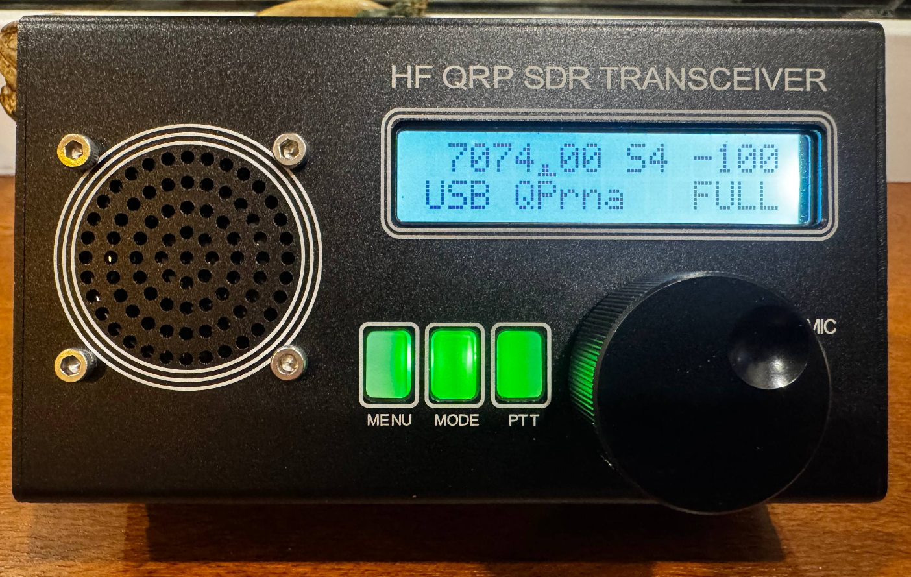

# uSDX / uSDR Firmware Fork

Рабочий форк прошивки uSDX/uSDR для ATmega328P/Arduino Uno.



## Ownership

- Current fork and maintenance: Peerat
- Current GitHub repo: `https://github.com/peerat/usdx`
- Current author channel: `https://t.me/ham33operator`
- Base source project: `https://github.com/threeme3/QCX-SSB`
- Base DSP/firmware author: Guido PE1NNZ
- Prior major modification layer preserved in this fork: Rob Colclough GW8RDI
- License and origin notes: [LICENSE.md](/home/peerat/projects/usdx/LICENSE.md)

Проект держится как практичная рабочая прошивка под реальное радио и как база
для compile-time "трансформера" с hardware/UI/size профилями.

## What Changed Relative To Base

Эта ветка не переписывает базовую прошивку с нуля, а делает ее удобнее для
живого использования на конкретном трансивере. Относительно базовой QCX-SSB/uSDX
здесь изменены меню и кнопки, приведены в порядок дефолты под SSB/CW/FT8,
добавлены CAT `115200`, SWR, автопрокрутка с адаптивной остановкой по сигналу,
точная подстройка к локальному максимуму, более понятный экран и compile-time
профили для разных вариантов железа и экономии памяти.

## Status

- Main firmware: `R3VAF_uSDR_7_01v.ino`
- Current baseline profile: `uno`
- Current baseline build: `Flash 32056 / 32256`, `RAM 1396 / 2048`
- Default `ScanStop`: `+3 dB`

## Build

```bash
platformio run -e uno
```

Если нужен локальный PlatformIO cache:

```bash
PLATFORMIO_CORE_DIR=.pio-core PLATFORMIO_SETTING_ENABLE_TELEMETRY=No platformio run -e uno
```

## Project Structure

| Path | Purpose |
| --- | --- |
| `R3VAF_uSDR_7_01v.ino` | Main firmware |
| `platformio.ini` | Build profiles: baseline, smoke-test, size-first |
| `MEMORY.md` | Flash/RAM map and size profiles |
| `CHANGELOG.md` | Important fork-level changes only |
| `LICENSE.md` | Source and license notes |
| `docs/USER_GUIDE_RU.md` | User guide and live-board bring-up |
| `docs/ARCHITECTURE.md` | Firmware and repo structure |
| `docs/DEVELOPMENT.md` | Development workflow |
| `tools/size_profiles.sh` | Batch size check |

## Build Profiles

- `uno`: baseline firmware
- `uno_no_*`: one-feature measurement profiles
- `uno_hw_*`: hardware smoke-test profiles
- `uno_ui_*`: display/UI smoke-test profiles
- `uno_size_*`: practical low-flash profiles

Подробности по памяти: [MEMORY.md](/home/peerat/projects/usdx/MEMORY.md)

## Docs

- User guide: [docs/USER_GUIDE_RU.md](/home/peerat/projects/usdx/docs/USER_GUIDE_RU.md)
- Architecture: [docs/ARCHITECTURE.md](/home/peerat/projects/usdx/docs/ARCHITECTURE.md)
- Development: [docs/DEVELOPMENT.md](/home/peerat/projects/usdx/docs/DEVELOPMENT.md)
- Changelog: [CHANGELOG.md](/home/peerat/projects/usdx/CHANGELOG.md)
